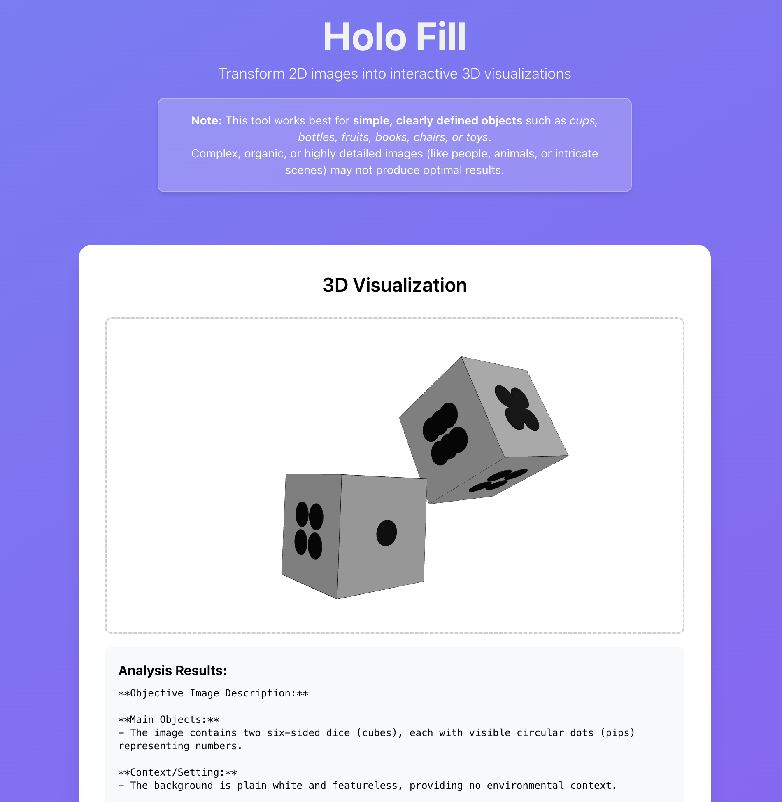

# Holo Fill

Transform 2D images into interactive 3D visualizations using AI analysis.

## Overview

Holo Fill is a web application that allows users to upload images and convert them into 3D visualizations. The system uses OpenAI's API to analyze image content and generate 3D representations that can be explored interactively.

## Features

- **Image Upload**: Drag-and-drop or file picker for image uploads
- **AI Analysis**: OpenAI-powered image analysis for depth and content understanding
- **3D Generation**: Conversion of 2D images to interactive 3D models
- **Web Visualization**: Interactive 3D display using Three.js
- **Memory Efficient**: Images processed in-memory without permanent storage
- **Modern UI**: Responsive React-based interface with TypeScript

## Tech Stack

### Backend

- **Python 3.11+**
- **FastAPI** - Modern, fast web framework
- **OpenAI API** - Image analysis and 3D generation
- **Pydantic** - Data validation
- **Uvicorn** - ASGI server
- **Poetry** - Dependency management

### Frontend

- **React 18** - Modern React with hooks
- **TypeScript** - Type-safe JavaScript
- **Three.js** - 3D visualization library
- **Tailwind CSS** - Utility-first CSS framework
- **Vite** - Fast build tool and dev server

## Project Structure

```
holo_fill/
├── backend/
│   ├── app/
│   │   ├── __init__.py
│   │   ├── main.py
│   │   ├── api/
│   │   │   ├── __init__.py
│   │   │   └── routes.py
│   │   ├── core/
│   │   │   ├── __init__.py
│   │   │   ├── config.py
│   │   │   ├── exceptions.py
│   │   │   └── utils.py
│   │   ├── models/
│   │   │   ├── __init__.py
│   │   │   └── image.py
│   │   ├── prompts/
│   │   │   ├── describe_image.txt
│   │   │   ├── generate_threejs_html_simple.txt
│   │   │   └── generate_threejs_html_v1.txt
│   │   └── services/
│   │       ├── __init__.py
│   │       ├── image_service.py
│   │       └── openai_service.py
│   ├── env.example
│   └── pyproject.toml
├── frontend/
│   ├── public/
│   ├── src/
│   │   ├── components/
│   │   ├── hooks/
│   │   └── App.tsx
│   ├── package.json
│   └── tsconfig.json
├── tests/
├── pyproject.toml
├── setup.sh
└── README.md
```

## Getting Started

### Prerequisites

- Python 3.11+
- Node.js 16+ and npm
- Poetry (Python package manager)
- OpenAI API key
- Modern web browser

### Installation

1. Clone the repository:

```bash
git clone <repository-url>
cd holo_fill
```

2. Run the setup script:

```bash
./setup.sh
```

Or manually:

1. Install Poetry (if not already installed):

```bash
curl -sSL https://install.python-poetry.org | python3 -
```

2. Install backend dependencies:

```bash
poetry install
```

3. Install frontend dependencies:

```bash
cd frontend
npm install
cd ..
```

4. Set up environment variables:

```bash
cp backend/env.example backend/.env
# Edit backend/.env with your OpenAI API key
```

5. Start the development servers:

**Backend:**

```bash
poetry run uvicorn app.main:app --reload
```

**Frontend (in a separate terminal):**

```bash
cd frontend
npm start
```

6. Open your browser to `http://localhost:3000`

## Development

### Backend Development

- FastAPI with automatic API documentation at `/docs`
- Structured with clear separation of concerns:
  - `api/` - API routes and endpoints
  - `core/` - Configuration, exceptions, and utilities
  - `models/` - Data models and validation
  - `services/` - Business logic and external API integration
  - `prompts/` - OpenAI prompt templates
- Type hints and validation with Pydantic
- Poetry for dependency management

### Frontend Development

- React 18 with TypeScript for type safety
- Component-based architecture with custom hooks
- Tailwind CSS for styling
- Three.js for 3D visualization
- Jest and React Testing Library for testing

### Development Commands

```bash
# Backend
poetry run black .          # Format code
poetry run isort .          # Sort imports
poetry run flake8 .         # Lint code
poetry run mypy .           # Type check
poetry run pytest           # Run tests
poetry run uvicorn app.main:app --reload  # Run dev server

# Frontend
cd frontend
npm start                   # Run dev server
npm test                    # Run tests
npm run build              # Build for production
npm run lint               # Lint code
```

## API Endpoints

- `POST /upload` - Upload and analyze image
- `GET /health` - Health check
- `GET /docs` - API documentation (Swagger UI)

## Contributing

1. Follow the established code style and patterns
2. Write tests for new functionality
3. Update documentation as needed
4. Use conventional commit messages

## License

[Add your license here]

## Roadmap

- [x] Basic image upload functionality
- [x] OpenAI API integration
- [x] 3D model generation
- [x] Web-based 3D visualization
- [x] React frontend with TypeScript
- [x] Component-based architecture
- [ ] Performance optimizations
- [ ] Advanced AI analysis features
